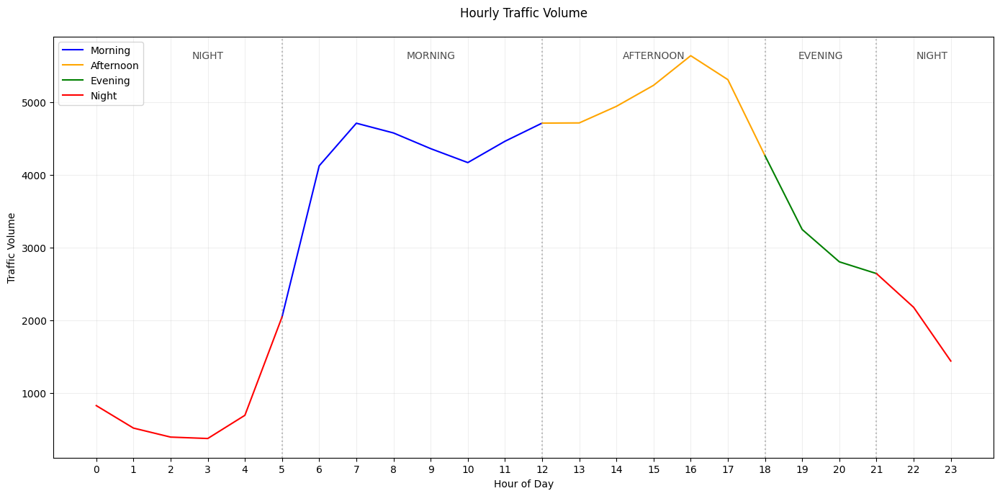

# Traffic Flow Prediction for Chicago Midterm Report
## Data Preprocessing

- Cleaned the dataset (e.g., replaced `nil`/missing values).
- Normalized numerical features to ensure consistent scale.
- Encoded categorical variables using **Label Encoding**.
- Parsed the `date_time` column into separate features:
  - `year`, `month`, `day`, and `time`
- Converted `time` into a float to represent the time of day numerically.
- Applied **Label Encoding** to `year`, `month`, and `day` for model compatibility.

## Exploratory Data Analysis
- Goal: Spot patterns, anomalies, and correlations between different columns.
- Analyze trends of traffic volume based on different parameters/conditions as is in the dataset.
- Visualize these different ideas and explain notable changes in plots
- Key insights to explore in this dataset:
  - Hourly traffic volumes
  - Traffic volumes for different days of the week
  - Weekday v/s Weekend traffic volumes
  - Weather impact on traffic volume

1. Hourly Traffic Trends

-	Productivity Hours (6AM-6PM)
-	Steady climb from 6AM with twin peaks at:
  -	~8AM (sharp school/work commute)
  -	~5PM (more dispersed evening return)
-	Midday plateau (10AM-3PM) suggests consistent commercial activity.
-	Leisure Transition (6PM-9PM)
-	Gradual decline but remains elevated vs. night
-	Small bump at ~7PM likely from:
  -	Dinner outings
  -	Gym/errand runs
  -	Ride-share leisure trips
-	Quiet Hours (9PM-6AM)
  -	Traffic bottoms out at ~30% of peak capacity
  -	Notable 3AM trough (lowest point in 24h cycle)
-	Hidden Details
  -	The 6AM "switch flip" - Traffic jumps 40% in 30 minutes when night becomes morning
  -	Pre-noon dip - Small but consistent 11AM lull (coffee break effect?)
  -	Evening steps - Clear 18:00 and 20:00 drops as people arrive home
  -	Midnight anomaly - Tiny 11:50PM bump (bar closings/shift changes?)

## Linear Regression Model 
Using the pre-processed dataset, the linear regression model yielded a mean squared error of approximately 0.50 and an R-squared value of 0.51, the model explains about 51% of the variability in traffic volume, demonstrating a moderate fit that serves as a baseline for more complicated, non-linear models.

We also tried two regularization methods, ridge regression (with regularization parameter alpha=10.0) and lasso(with regularization parameter alpha=.001), which yielded similar results:

| Model                      | Mean Squared Error    | R-squared   |
|---------------------------|--------------------------------|-----------------|
| Linear Regression  | 0.50              | 0.51      |
| Ridge Regression   | 0.50              | 0.51      |
| Lasso  Regression                    | 0.50              | 0.51      |

## MLP Regressor Model

A neural network-based regression model was employed to predict a continuous target variable. The key performance metrics for this model were:

- **R² Score**: 0.493  
  This indicates that the model explains about 49% of the variance in the target variable.

- **Mean Squared Error (MSE)**: 1.243  
  On average, the squared error between the predicted and actual values is 1.243.

While the MLP Regressor captures a moderate amount of the data variability, there remains substantial unexplained variance. It achieved a moderate performance, indicating that while the model explains nearly half of the variance, further optimization could improve its predictive ability.

## Logistic Regression Model

Performance metrics of this linear classification model were as follows:

- **Accuracy**: 39.8%  
  The model correctly classified about 40% of the instances.

### Confusion Matrix and Classification Report

The confusion matrix shows significant misclassification across classes. Precision and recall values ranged roughly from 0.35 to 0.47 and 0.21 to 0.53, respectively. This indicates that the model is struggling to correctly identify instances for each class.

Logistic regression, which relies on linear decision boundaries, seems insufficient to capture the complexity of the data’s class structure. Its lower overall accuracy and imbalanced performance across classes suggest that a more flexible or non-linear model might be more appropriate.

Overall, with an accuracy of about 40%, logistic regression struggled with the multi-class problem, likely due to its reliance on linear separability, which does not sufficiently capture the data’s complexity.

## Decision Tree Classifier Model

This model builds a tree-like structure to classify the data and is capable of modeling non-linear relationships. The performance metrics were:

- **Accuracy**: 63.7%  
  The decision tree correctly classified approximately 64% of the instances.

### Confusion Matrix and Classification Report

With precision values ranging from 0.55 to 0.78 and recall values from 0.60 to 0.73 across classes, the decision tree provides a more balanced performance compared to logistic regression.

The decision tree classifier outperformed logistic regression by capturing more complex patterns in the data, leading to higher overall accuracy and better class-wise performance. It was the best performer among the classification models, making it a strong candidate for this dataset due to its ability to model non-linear relationships.

## XGBoost Model 

### Data Preparation
- Loaded the preprocessed traffic data.
- Performed an 80/20 train-test split.

### Hyperparameter Tuning
- Conducted a grid search with 5-fold cross-validation on:
  - Regularization parameters: `alpha`, `lambda`, `gamma`
  - Learning rate: `eta`
  - Tree depth: `max_depth`
- **Best parameters found**:
  - `gamma`: 0  
  - `eta`: 0.3  
  - `max_depth`: 8  
  - `alpha`: 1  
  - `lambda`: 10

### Model Performance
- **Training RMSE**: 0.095  
- **Testing RMSE**: 0.158  
- RMSE plot shows that after ~5–6 boosting rounds, the model generalizes well.
- The small gap between training and testing RMSE indicates **no overfitting**.

  
  

### Feature Importance
- **By Weight**:
  - **Feature 10 (Temperature)** was the most frequently used for splits.
- **By Gain**:
  - **Feature 2 (Time of Day: Morning, Afternoon, Evening)** contributed the most to improving predictive accuracy.
- **Feature 3 (Holiday)** had minimal importance in both metrics, suggesting limited impact on traffic volume predictions.

### Conclusion
XGBoost demonstrated strong predictive power for traffic volume forecasting. It generalized well to unseen data and offered interpretability through feature importance analysis.

## Model Comparison and Inferences

For this project, **seven different regression models** were applied to predict traffic volume after performing hyperparameter tuning using `GridSearchCV` where applicable. The models evaluated include:

1. **Linear Regression**  
   A baseline model that assumes a linear relationship between features and target.  
   - No hyperparameters tuned.

2. **Ridge Regression**  
   A regularized linear model with L2 penalty to prevent overfitting.  
   - Tuned hyperparameter: `alpha`.

3. **Lasso Regression**  
   A linear model with L1 penalty that encourages sparsity in coefficients.  
   - Tuned hyperparameter: `alpha`.

4. **Support Vector Regressor (SVR)**  
   Uses support vectors to minimize prediction error while maintaining simplicity.  
   - Tuned hyperparameters: `C`, `epsilon`, `kernel`.

5. **Random Forest Regressor**  
   An ensemble method that aggregates multiple decision trees for improved stability and accuracy.  
   - Tuned hyperparameters: `n_estimators`, `max_depth`, `min_samples_split`, `min_samples_leaf`.

6. **Gradient Boosting Regressor**  
   Builds trees sequentially, with each tree correcting the errors of the previous one.  
   - Tuned hyperparameters: `n_estimators`, `learning_rate`, `max_depth`.

7. **XGBoost Regressor**  
   A high-performance, scalable model widely used for structured data tasks.  
   - Tuned hyperparameters: `n_estimators`, `max_depth`, `learning_rate`, `subsample`, `colsample_bytree`.

### Hyperparameter Tuning
- **R² Score**
- **Root Mean Squared Error (RMSE)**

## Model Comparison and Inference Summary

### Regression Model Performance

| Model                     | R² Score | RMSE   |
|---------------------------|----------|--------|
| XGBoost Regressor         | 0.9753   | 0.157  |
| Random Forest Regressor   | 0.92     | 1.45   |
| Gradient Boosting Regressor | 0.91   | 1.50   |
| Support Vector Regressor  | 0.87     | 1.65   |
| Linear Regression         | 0.50     | 0.51   |
| Ridge Regression          | 0.50     | 0.51   |
| Lasso Regression          | 0.50     | 0.51   |

### Classification Models

| Model                     | Accuracy | Precision Range | Recall Range |
|---------------------------|----------|------------------|--------------|
| Decision Tree Classifier  | 63.7%    | 0.55 – 0.78      | 0.60 – 0.73  |
| Logistic Regression       | 39.8%    | 0.35 – 0.47      | 0.21 – 0.53  |

### Conclusion For First Half

- **XGBoost Regressor** is the recommended model for traffic volume prediction due to its better performance and low error.
- **Random Forest** is a good fallback model, especially when interpretability or resilience to noise is needed.
- **Decision Tree Classifier** is the best choice for classification tasks.
- **Linear and logistic models** can serve as simple baselines, but they underperform significantly on this dataset.
