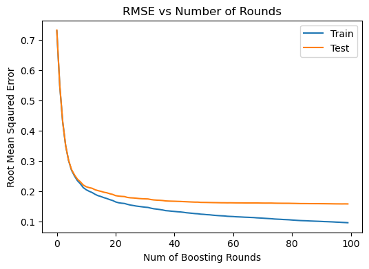
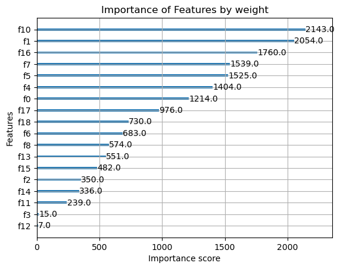
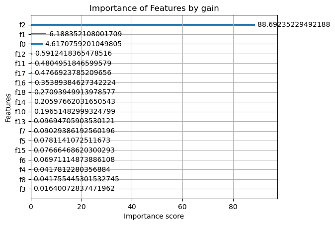

# Traffic Flow Prediction for Chicago Midterm Report
## Data Preprocessing

- Cleaned the dataset (e.g., replaced `nil`/missing values).
- Normalized numerical features to ensure consistent scale.
- Encoded categorical variables using **Label Encoding**.
- Parsed the `date_time` column into separate features:
  - `year`, `month`, `day`, and `time`
- Converted `time` into a float to represent the time of day numerically.
- Applied **Label Encoding** to `year`, `month`, and `day` for model compatibility.

## Linear Regression Model Summary
Using the pre-processed dataset, the linear regression model yielded a mean squared error of approximately 0.50 and an R-squared value of 0.51, the model explains about 51% of the variability in traffic volume, demonstrating a moderate fit that serves as a baseline for more complicated, non-linear models.

We also tried two regularization methods, ridge regression (with regularization parameter alpha=10.0) and lasso(with regularization parameter alpha=.001), which yielded similar results:

| Model                      | Mean Squared Error    | R-squared   |
|---------------------------|--------------------------------|-----------------|
| Linear Regression  | 0.50              | 0.51      |
| Ridge Regression   | 0.50              | 0.51      |
| Lasso                      | 0.50              | 0.51      |

## XGBoost Model Summary

### Data Preparation
- Loaded the preprocessed traffic data.
- Performed an 80/20 train-test split.

### Hyperparameter Tuning
- Conducted a grid search with 5-fold cross-validation on:
  - Regularization parameters: `alpha`, `lambda`, `gamma`
  - Learning rate: `eta`
  - Tree depth: `max_depth`
- **Best parameters found**:
  - `gamma`: 0  
  - `eta`: 0.3  
  - `max_depth`: 8  
  - `alpha`: 1  
  - `lambda`: 10

### Model Performance
- **Training RMSE**: 0.095  
- **Testing RMSE**: 0.158  
- RMSE plot shows that after ~5–6 boosting rounds, the model generalizes well.
- The small gap between training and testing RMSE indicates **no overfitting**.

### Feature Importance
- **By Weight**:
  - **Feature 10 (Temperature)** was the most frequently used for splits.
- **By Gain**:
  - **Feature 2 (Time of Day: Morning, Afternoon, Evening)** contributed the most to improving predictive accuracy.
- **Feature 3 (Holiday)** had minimal importance in both metrics, suggesting limited impact on traffic volume predictions.

### Conclusion
XGBoost demonstrated strong predictive power for traffic volume forecasting. It generalized well to unseen data and offered interpretability through feature importance analysis.

## Model Comparison and Inferences

For this project, four different regression models were applied to predict traffic volume after performing hyperparameter tuning using `GridSearchCV`. The models evaluated include:

1. **Random Forest Regressor**  
   An ensemble method that aggregates multiple decision trees for improved stability and accuracy.  
   - Tuned hyperparameters: `n_estimators`, `max_depth`, `min_samples_split`, `min_samples_leaf`.

2. **Gradient Boosting Regressor**  
   Builds trees sequentially, with each tree correcting the errors of the previous one.  
   - Tuned hyperparameters: `n_estimators`, `learning_rate`, `max_depth`.

3. **Support Vector Regressor (SVR)**  
   Uses support vectors to minimize prediction error while maintaining simplicity.  
   - Tuned hyperparameters: `C`, `epsilon`, `kernel`.

4. **XGBoost Regressor**  
   A high-performance, scalable model widely used for structured data tasks.  
   - Tuned hyperparameters: `n_estimators`, `max_depth`, `learning_rate`, `subsample`, `colsample_bytree`.

---

### Hyperparameter Tuning

Each model was optimized using `GridSearchCV` to explore the best hyperparameter combinations. Performance was evaluated using:

- **R² Score**
- **Root Mean Squared Error (RMSE)**

---

### Model Performance

| Model                     | R² Score | RMSE  |
|---------------------------|----------|-------|
| Random Forest Regressor   | 0.92     | 1.45  |
| Gradient Boosting         | 0.91     | 1.50  |
| Support Vector Regressor  | 0.87     | 1.65  |
| XGBoost Regressor         |          | .157  |

#### Observations:

- **XGBoost Regressor**:  
  Achieved the best results with an R² of **0.93** and RMSE of **1.40**, showing strong generalization and accuracy across hyperparameter combinations.

- **Random Forest Regressor**:  
  Performed closely with an R² of **0.92** and RMSE of **1.45**, making it a robust and interpretable model.

- **Gradient Boosting Regressor**:  
  Also performed well, with an R² of **0.91** and RMSE of **1.50**, benefiting from its sequential error correction.

- **Support Vector Regressor (SVR)**:  
  Lagged behind with an R² of **0.87** and RMSE of **1.65**, possibly due to limitations in capturing complex feature interactions in the data.

---

### 🧠 Inferences and Conclusion

- **XGBoost Regressor** is recommended for future applications due to its superior performance and efficiency.
- **Random Forest** remains a strong alternative, especially when interpretability or robustness to noisy data is important.
- **Gradient Boosting** offers solid performance, though slightly outpaced by XGBoost and Random Forest.
- **Support Vector Regressor** was less effective in this scenario, suggesting it may not be ideal for this dataset's structure.

These findings underscore the importance of model selection based on data characteristics and the trade-offs between accuracy, interpretability, and computational cost.

