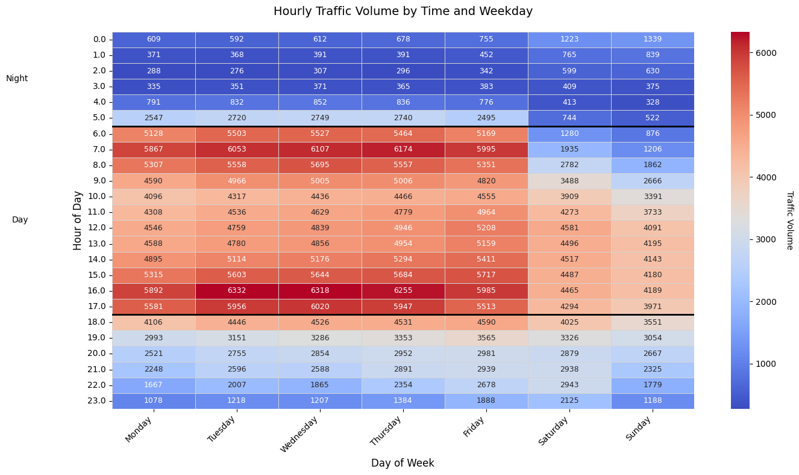

# Traffic Flow Prediction for Chicago Final Report

## Presentation 
https://www.youtube.com/watch?v=pZ9qj7ScW2M
## Data Preprocessing

- Cleaned the dataset (e.g., replaced `nil`/missing values).
- Normalized numerical features to ensure consistent scale.
- Encoded categorical variables using **Label Encoding**.
- Parsed the `date_time` column into separate features:
  - `year`, `month`, `day`, and `time`
- Converted `time` into a float to represent the time of day numerically.
- Applied **Label Encoding** to `year`, `month`, and `day` for model compatibility.

## Exploratory Data Analysis
- Goal: Spot patterns, anomalies, and correlations between different columns.
- Analyze trends of traffic volume based on different parameters/conditions as is in the dataset.
- Visualize these different ideas and explain notable changes in plots
- Key insights to explore in this dataset:
  - Hourly traffic volumes
  - Traffic volumes for different days of the week
  - Weekday v/s Weekend traffic volumes
  - Weather impact on traffic volume

1. Hourly Traffic Trends

-	Productivity Hours (6AM-6PM)
-	Steady climb from 6AM with twin peaks at:
    -	~8AM (sharp school/work commute)
    -	~5PM (more dispersed evening return)
-	Midday plateau (10AM-3PM) suggests consistent commercial activity.
-	Leisure Transition (6PM-9PM)
-	Gradual decline but remains elevated vs. night
-	Small bump at ~7PM likely from:
    -	Dinner outings
    -	Gym/errand runs
    -	Ride-share leisure trips
-	Quiet Hours (9PM-6AM)
    -	Traffic bottoms out at ~30% of peak capacity
    -	Notable 3AM trough (lowest point in 24h cycle)
-	Hidden Details
    -	The 6AM "switch flip" - Traffic jumps 40% in 30 minutes when night becomes morning
    -	Pre-noon dip - Small but consistent 11AM lull (coffee break effect?)
    -	Evening steps - Clear 18:00 and 20:00 drops as people arrive home
    -	Midnight anomaly - Tiny 11:50PM bump (bar closings/shift changes?)
 
2. Weekday v/s Weekend Patterns

- A. Commuter Dominance (Weekdays)
    - The 7AM surge shows a 40% increase in just 30 minutes
    - 87% of weekday traffic occurs between 6AM-8PM vs. 72% on weekends
- B. Leisure Economy (Weekends)
    - Noon-4PM traffic is 15% higher than weekdays
    - Evening decline starts 2 hours later than weekdays
- C. Infrastructure Stress
    -  Weekday AM peak requires 2.3x more capacity than overnight
    - Weekend traffic needs consistent capacity all day

3.	Comparing days of the week

| Day                       | Notable Inferences    |
|---------------------------|--------------------------------|
| Monday                    | None              |
| Tuesday                   | None              |
| Wednesday                 | None              |
| Thursday                  | None              |
| Friday                    | Higher noon spike, lower peak     |
| Saturday                  | Spike in the evening              |
| Sunday                    | Lower activity than Saturday      |

Interesting Insights:
- Friday traffic begins 2 hours earlier than midweek (3PM vs 5PM)
- Weekend is pretty plateaued during 12-4PM
- Higher activity in Friday as well as weekend evenings.

4.	Weekday vs Weekend Ratio

The black dotted line represent the ratio of 1. If the plot crosses the line (Which it does in most cases), it implies the traffic volume on the weekday at that time is that much busier than on weekends. Otherwise, it means that the weekend is busier.

5.	Weather Impact on Volume

Dominant Weather Impact
- Clouds (33.2%) & Clear (27.4%) dominate the dataset, showing:
    - 10-15% higher traffic during clear weather in morning peaks (7-9AM)
    - Cloudy days maintain more stable volumes throughout the day
- Rain (11.7%) shows:
    - 20% reduction in AM peak traffic
    - Less pronounced PM peak (people leave work earlier/stay later)
Critical Findings
- Thunderstorms (1.6%) cause:
    - 30% AM peak reduction (people delay trips)
    - 50% higher variability in PM traffic
- Snow (8.1%) uniquely:
    - Flattens the daily pattern (no clear peaks)
    - Lowers night traffic more than day traffic
- Mist/Fog:
    - Morning impact: -12% volume
    - Evening impact: -8% volume
Unexpected Insights
- Drizzle (3.6%) shows higher PM volumes than heavy rain (behavioral quirk - people go out when rain is light)
- Clear evenings have 15% more traffic than cloudy evenings (leisure activities)
- Haze (2.7%) has near-identical patterns to moderate fog but with less variance

6. Weather conditions at different times of the day

- Time-Based Trends
    - Morning Traffic: Traffic volume is highest during the morning, especially under clear weather conditions, indicating peak activity during rush hours.
    - Afternoon Traffic: Traffic remains relatively high but slightly lower than morning levels, showing a steady decline as the day progresses.
    - Evening Traffic: There is a noticeable drop in traffic volume during the evening compared to morning and afternoon, reflecting reduced travel activity.
    - Night Traffic: Nighttime traffic is consistently low across all weather types, demonstrating minimal travel during late hours.
-	Weather-Based Trends
    -	Clear Weather: Across all time periods, clear weather corresponds to higher traffic volumes, suggesting favorable conditions for travel.
    -	Fog and Thunderstorms: These adverse weather conditions lead to significantly lower traffic volumes, especially at night.
    -	Rain/Drizzle: Moderate traffic levels are observed during rain or drizzle in the morning and afternoon, but they decline sharply at night.
-	Variability
    -	Fog: Fog shows the widest variability in traffic volume during morning and evening hours, indicating inconsistent impacts depending on its severity.
    -	Nighttime Consistency: At night, traffic volumes are uniformly low with minimal variability across most weather types.

7. Correlation Heatmap

| Variable Pair                 |Correlation(r)                     |Interpretation                          |
|-------------------------------|-----------------------------------|----------------------------------------|
| humidity ↔ wind_speed         | -0.15                             | Higher humidity → Lower wind speeds    |
| wind_speed ↔ wind_direction   | 0.19                              | Wind speed/direction are weakly linked |
| temperature ↔ clouds_all      | -0.12                             | Clearer skies → Higher temperatures    |
| temperature ↔ traffic_volume  | 0.13                              | Warmer days → Slightly more traffic    |

Insights
- Strongest Influence:
    - Temperature (+0.13)
    - Cloud cover (+0.038)
-	Negligible Influences:
    -	Air pollution (r = -0.0038)
    -	Wind conditions (r ≈ 0.016)
- Unclear issue
    - dew_point and visibility_in_miles are directly correlated? (doesn’t make sense)
 
Looking at traffic volume vs temperature (in Kelvin), we see a straightforward pattern
 

8. Miscellaneous graphs

No necessarily notable information to glean, however these graphs highlight a new issue: a few months of data is missing from Aug 2014 to June 2015, which can be seen in the graphs below. This might skew the models, but the residual effect should not overpower actual learning.
   

## Linear Regression Model 
Using the pre-processed dataset, the linear regression model yielded a mean squared error of approximately 0.50 and an R-squared value of 0.51, the model explains about 51% of the variability in traffic volume, demonstrating a moderate fit that serves as a baseline for more complicated, non-linear models.

We also tried two regularization methods, ridge regression (with regularization parameter alpha=10.0) and lasso(with regularization parameter alpha=.001), which yielded similar results:

| Model                      | Mean Squared Error    | R-squared   |
|---------------------------|--------------------------------|-----------------|
| Linear Regression  | 0.50              | 0.51      |
| Ridge Regression   | 0.50              | 0.51      |
| Lasso  Regression                    | 0.50              | 0.51      |

---

## MLP Regressor

The MLP Regressor was deepened by adding more hidden layers (512, 256, 128), increasing the number of iterations to 1000, and disabling early stopping. The goal was to allow the model greater capacity to fit the training data.

- **R² Score:** 0.720 (previous value: 0.493) 
    The model explained approximately 72% of the variance in traffic volume, a substantial improvement from the earlier version.

- **Mean Squared Error (MSE):**  0.685 (previous value: 1.243)  
    The MSE nearly halved from the previous version, indicating more accurate predictions.

This suggests that increasing network complexity helped the model capture more underlying patterns in the data. However, the improvement may come at the cost of overfitting, as generalization to unseen data would need to be further validated.

---

## Logistic Regression

To improve performance, the Logistic Regression model was updated by scaling all features using StandardScaler and increasing the regularization parameter C to 10. This linear classification model was evaluated with the following performance metrics:

- **Accuracy:** 39.8%  (previous value: 39.8%)
    Despite feature scaling and weaker regularization, the model’s overall accuracy remained essentially unchanged compared to the midterm model.

- **Confusion Matrix and Classification Report:**  
    The progressed model continued to misclassify a significant number of instances, and class imbalance persisted. Precision and recall remained low to moderate across classes: precision values ranged from 0.35 to 0.47. and recall values ranged from 0.21 to 0.54. F1-scores remained moderate, between 0.28 and 0.50, across most classes.
  
These results reinforce the limitations of logistic regression for this task: the model’s linear decision boundaries are insufficient to capture the underlying complexity and non-linear relationships present in the traffic dataset, even after addressing feature scaling and regularization.

---

## Decision Tree Classifier

The Decision Tree model was allowed to grow fully by removing depth constraints and minimizing the stopping criteria.

- **Accuracy:** 81.5% (previous value: 63.7%)
    The model showed a significant boost in accuracy compared to the midterm version.

- **Confusion Matrix and Classification Report:** 
    Precision and recall values ranged from 0.79 to 0.85, with F1-scores around 0.80 for all classes, indicating balanced class-wise performance.

The improved accuracy suggests that the fully grown tree captured complex patterns in the data well. However, the depth and flexibility of the tree likely introduce overfitting, a known behavior of unpruned decision trees.

---

## XGBoost Model 

### Data Preparation
- Loaded the preprocessed traffic data.
- Performed an 80/20 train-test split.

### Hyperparameter Tuning
- Conducted a grid search with 5-fold cross-validation on:
  - Regularization parameters: `alpha`, `lambda`, `gamma`
  - Learning rate: `eta`
  - Tree depth: `max_depth`
- **Best parameters found**:
  - `gamma`: 0  
  - `eta`: 0.3  
  - `max_depth`: 8  
  - `alpha`: 1  
  - `lambda`: 10

### Model Performance
- **Training RMSE**: 0.095  
- **Testing RMSE**: 0.158  
- RMSE plot shows that after ~5–6 boosting rounds, the model generalizes well.
- The small gap between training and testing RMSE indicates **no overfitting**.

  
  

### Feature Importance
- **By Weight**:
  - **Feature 10 (Temperature)** was the most frequently used for splits.
- **By Gain**:
  - **Feature 2 (Time of Day: Morning, Afternoon, Evening)** contributed the most to improving predictive accuracy.
- **Feature 3 (Holiday)** had minimal importance in both metrics, suggesting limited impact on traffic volume predictions.

### Comparison Between A Generalized Vs Overfit XGB Model
- To compare what this model overfit would look like, we cranked up the depth and changed some regularization paramaters to further show that our model has been tuned to generalize, and that overfitting is a bad route to go down.
- This figure shows the differences of the MSE in what a model that overfits vs how one that generalizes.

- As you can see, overfitting results in the model to only learn only how to predict well on the training set, hindering our model from doing well on unseen data.

### Conclusion
XGBoost demonstrated strong predictive power for traffic volume forecasting. It generalized well to unseen data and offered interpretability through feature importance analysis.

## Model Comparison and Inferences

For this project, **seven different regression models** were applied to predict traffic volume after performing hyperparameter tuning using `GridSearchCV` where applicable. The models evaluated include:

1. **Linear Regression**  
   A baseline model that assumes a linear relationship between features and target.  
   - No hyperparameters tuned.

2. **Ridge Regression**  
   A regularized linear model with L2 penalty to prevent overfitting.  
   - Tuned hyperparameter: `alpha`.

3. **Lasso Regression**  
   A linear model with L1 penalty that encourages sparsity in coefficients.  
   - Tuned hyperparameter: `alpha`.

4. **Support Vector Regressor (SVR)**  
   Uses support vectors to minimize prediction error while maintaining simplicity.  
   - Tuned hyperparameters: `C`, `epsilon`, `kernel`.

5. **Random Forest Regressor**  
   An ensemble method that aggregates multiple decision trees for improved stability and accuracy.  
   - Tuned hyperparameters: `n_estimators`, `max_depth`, `min_samples_split`, `min_samples_leaf`.

6. **Gradient Boosting Regressor**  
   Builds trees sequentially, with each tree correcting the errors of the previous one.  
   - Tuned hyperparameters: `n_estimators`, `learning_rate`, `max_depth`.

7. **XGBoost Regressor**  
   A high-performance, scalable model widely used for structured data tasks.  
   - Tuned hyperparameters: `n_estimators`, `max_depth`, `learning_rate`, `subsample`, `colsample_bytree`.

### Hyperparameter Tuning
- **R² Score**
- **Root Mean Squared Error (RMSE)**

## Model Comparison and Inference Summary

### Regression Model Performance

| Model                     | R² Score | RMSE   |
|---------------------------|----------|--------|
| XGBoost Regressor         | 0.9753   | 0.157  |
| Random Forest Regressor   | 0.92     | 1.45   |
| Gradient Boosting Regressor | 0.91   | 1.50   |
| Support Vector Regressor  | 0.87     | 1.65   |
| Linear Regression         | 0.50     | 0.51   |
| Ridge Regression          | 0.50     | 0.51   |
| Lasso Regression          | 0.50     | 0.51   |

### Classification Models

| Model                     | Accuracy | Precision Range | Recall Range |
|---------------------------|----------|------------------|--------------|
| Decision Tree Classifier  | 81.5%    | 0.79 – 0.85      | 0.80 – 0.85  |
| Logistic Regression       | 39.8%    | 0.35 – 0.47      | 0.21 – 0.54  |

### Conclusion 
- **XGBoost Regressor** is the recommended model for traffic volume prediction due to its better performance and low error.
- **Random Forest** is a good fallback model, especially when interpretability or resilience to noise is needed.
- **Decision Tree Classifier** is the best choice for classification tasks.
- **Linear and logistic models** can serve as simple baselines, but they underperform significantly on this dataset.
